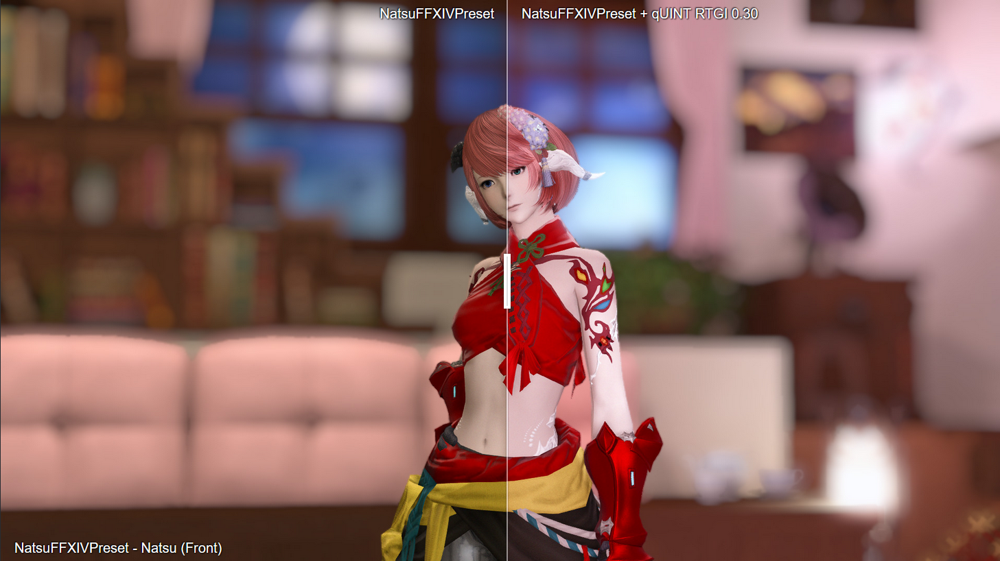
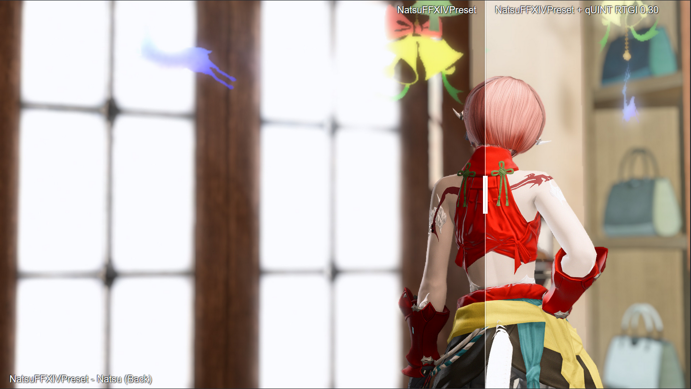

# NatsuFFXIVPreset 6.0 for GShade 3.4.1 / Reshade 4.9.1

[[Download](https://downgit.github.io/#/home?url=https://github.com/NatsumeLS/NatsuReShade/blob/main/NatsuFFXIVPreset/NatsuFFXIVPreset.ini)]

Suitable for both gameplay and screenshot usage.

Focus on being as close as real lighting as possible while not being over saturated.

Configurations for **qUINT RTGI 0.30** are included.

Access to beta version of RTGI require at least $5 Tier of [Pascal Gilcher's Patreon](https://www.patreon.com/mcflypg)

- **RTGlobalIllumination** is enabled by default (GTX 1070 / RTX 2060 or later is recommended)

- Ghosting on moving objects is caused by low GI responsiveness. (Disable **RTGlobalIllumination**)

- Enable **MartyMcFlyDOF** for Depth of Field Effect (Auto Focus on Mouse position)

# FPS Impacts
Tested on GTX 1080Ti
- NatsuFFXIVPreset ~10 FPS
- NatsuFFXIVPreset + qUINT RTGI ~40 FPS

# Recommended In-Game Settings
- Full Screen Gamma Correction: 75 (**Personal Preference**)
- Character Lighting: 10
- Edge Smoothing (Anti-Aliasing): FXAA (**Important**)
- Transparent Lighting Quality: High (**Important**)
- Shadow LOD: Off
- Limb Darkening: Off
- Radial Blur: Off
- Screen Space Ambient Occlusion: Off (**Important**)
- Glare: Normal
- Water Refraction: Off (**Important**)
- Depth of Field: Off

# Changelog
On my Discord at [#updates](discord.gg/Fgkkq2T)

# Preview
**Click on image to view**

Thavnair [[Comparison](https://imgsli.com/MTAxMjgy)] [[Vanilla](Images/Thavnair_00.png)] [[Preset](Images/Thavnair_00.png)] [[with RTGI](Images/Thavnair_00.png)]

Mare Lamentorum [[Comparison](https://imgsli.com/MTAxMjgw)] [[Vanilla](Images/Mare_Lamentorum_00.png)] [[Preset](Images/Mare_Lamentorum_00.png)] [[with RTGI](Images/Mare_Lamentorum_00.png)]

Old Sharlayan [[Comparison](https://imgsli.com/MTAxMjgx)] [[Vanilla](Images/Old_Sharlayan_00.png)] [[Preset](Images/Old_Sharlayan_00.png)] [[with RTGI](Images/Old_Sharlayan_00.png)]

Natsu (Front) [[Comparison](https://imgsli.com/MTAxMjg0)] [[Vanilla](Images/Natsu_Front.png)] [[Preset](Images/Natsu_Front_00.png)] [[with RTGI](Images/Natsu_Front_00.png)]

Natsu (Back) [[Comparison](https://imgsli.com/MTAxMjg1)] [[Vanilla](Images/Natsu_Back.png)] [[Preset](Images/Natsu_Back_00.png)] [[with RTGI](Images/Natsu_Back_00.png)]

